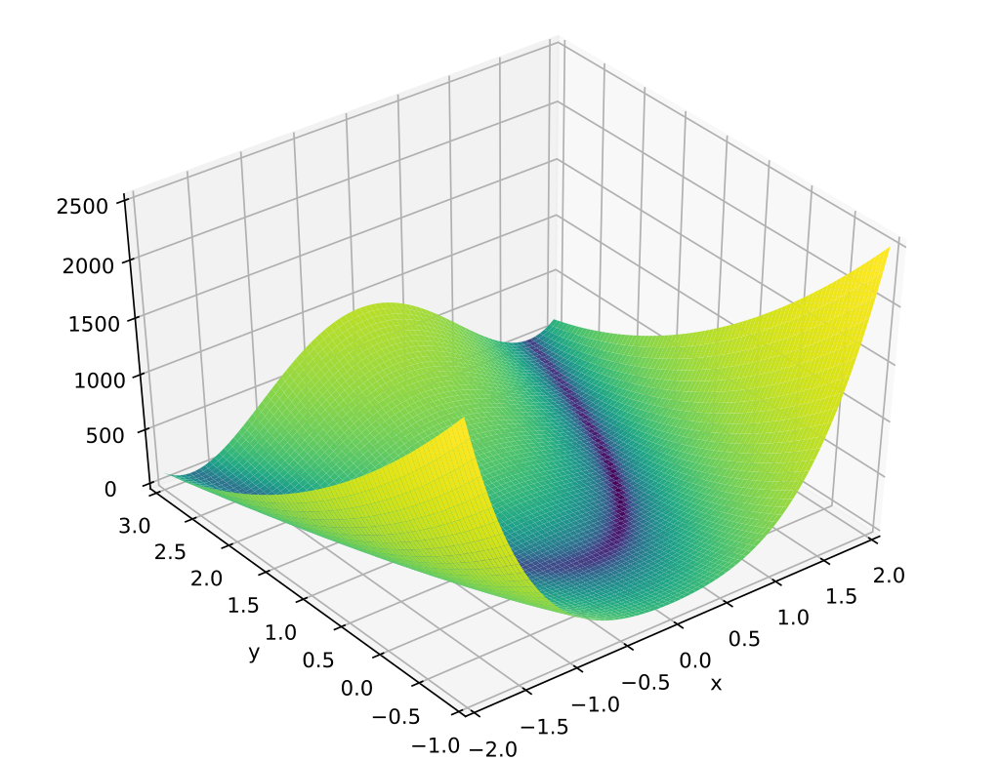

### 1. Optimization in R using optimize() and optim():
a. optimize() for 1-D case:
```{r}
?optimize
# Check Usage, Arguments, Value and Examples first
# See Details to find the detailed methods (golden section search combined with others) used in optimize()

# objective function
cubic = function(x) { 
  return(x^3 - 12 * x) 
}

# visualize it
curve(cubic, from = -6, to = 6, main = "Graph of y = x^3 - 12x")

# optimize it with domain [-6, 6]
optimize(cubic, lower = -6, upper = 6) # find a local minimum at x = 2 (verify it by calculus)
optimize(cubic, lower = -6, upper = 6, maximum = TRUE) # find a local maximum at x = -2 (verify it by calculus)
```
b. optim() for $n$-D case
```{r}
?optim 
# By default, optim performs minimization, but it will maximize if control$fnscale is negative.
# Check Usage, Arguments, Value and Examples first
# See Details to find the detailed methods used in optim()

# objective function
Rosenbrock <- function(x) { # one Rosenbrock (Banana) function, the touchstone of optimization methods
  x1 <- x[1] 
  x2 <- x[2]
  return(100 * (x2 - x1 * x1)^2 + (1 - x1)^2)
}

# visualize it
# You can write the code similar to day2.2.gradientDescent.R or NelderMead.R to visual it.
# Here, I will visual it with a better graph I found online. Just see below.
# Try to understand why it is called the banana function.
```

```{r}
# optimize it with starting point given by par
optim(par = c( -1,  -1), Rosenbrock) # find the global minimum is 0 at (1, 1) (verify it by calculus)
optim(par = c(-10, -10), Rosenbrock) # wrong answer!
```

c. Conclusion  

**Q:** That's all?  
**A:** No,  not at all. You need to understand much more subtleties here and choose an appropriate method with other parameters.

### Conclusion: There is NO UNIVERSAL method for optimization. There are only some ad-hoc solutions! 


### 2. Mathematical reviews for derivative-based methods:
**Key idea:** The zero derivative gives a stationary point, which might imply a local extremum. If you forget some fundamental calculus, [watch the video](https://www.youtube.com/watch?v=mamH094uw_U) first. More subtleties ([check the common mistakes here](https://www.khanacademy.org/math/ap-calculus-ab/ab-diff-analytical-applications-new/ab-5-4/a/applying-the-first-derivative-test-to-find-extrema)) should be mentioned as follows:  

a. Dimension: 1-D is easy (in Cal 1); $n$-D means taking partial derivatives and gradient (in Cal 3, much harder!)
b. Solving $f'(x) = 0$ is quite hard sometimes. Just try it for Rosenbrock function above. Or, use Newton's method (see part.4a).
c. Local vs global extrema: local (in small scale); global (king of kings, in large scale)
d. Differentiablity: Try to minimize absolute value function $|x|$. It reaches a global mininum at $x = 0$, where its derivative doesn't exist at all (non-differentiable).
e. Endpoints Issue: Actually, the cubic function $x^3 - 12x$ above reaches a global minimum/maximum at $x = \pm 6$! 
f. Stationary points is only NECESSARY conditions for finding a extremum: the cubic function $x^3$ have zero derivative at $x = 0$, where it doesn't reach any extremum.
g. **All the candidates of extrema: stationary points, non-differentiable points, and endpoints.**
h. A serious drawback of derivative: Small changes of values could lead to dramatic changes in its derivatives. For example, $0.01\sin(10000x)$ oscillates harshly at a tiny range but has a very large derivative at $x = 0$.


### 3. Computational or numerical techniques for iterative methods:
**Key idea:** use iterative methods with heuristic searching that converge to a solution in a finite number of steps. For more details, check part.4 Demos.

a. Starting point: How to choose a starting point is tricky. Different starting points leads to different results (usually a local extremum). Try it in part1b for Rosenbrock function.
b. Heuristics search: How to determine the next step or stop (w/ or w/o derivatives) is complicated and usually depends on the shape of the objective function.
c. Convergence issue: really convergent? converge too slowly (e.g., in the banana-shaped valley of Rosenbrock function)? reach a local or global extremum?
d. To get a global extremum, cut the whole domain into some small enough grids and try one starting point from each grid in a loop to get all the possible local extrema. Then, pick their extremum as the global extremum (king of kings).


### 4. Demos:
a. Newton's method (see day2.1.Newton.R)
b. Gradient descent method (see day2.2.gradientDescent.R)
c. Golden section method (see day2.3.goldenSectionSearch.R)
d. Nelder-Mead (N-M) method (see day2.4.NelderMead.R)
e. Know more methods in handout and ?optim: BFGS, CG, L-BFGS-B, SANN, Brent (check their pros and cons)


### 5. Procedure:
a. Understand and formulate the optimization problem
b. Visualize the objective function if possible
c. Choose an appropriate method
d. Write R code with optimize() or optim()
e. To get a global extremum, just pick the king of kings by changing the starting points.
f. Verify your answer by graph or other methods
g. If the result is not satisfactory in step f, go to step c. to try other starting points or control parameters or methods.


### 6. Examples:
a. SLR
```{r}
# Understand and formulate the optimization problem in SLR (see Day1 lecture)

# Objective function (also done in the Day1)
SSE = function(beta, x, y) { # usual least squares, done in Day 1
  return(sum((y - (beta[1] + beta[2] * x))^2))
}

# If you like, you can visualize it here. I just skip it.

# Search it by optim() with default N-M method and randomly-chosen starting point
# Make sure the changing variables is given correcly by par
out = optim(par = c(0, 0), fn = SSE, x = mtcars$wt, y = mtcars$mpg) # optinum over the first vector parameter
out

# Verify it with lm(), which is actually done by calculus (try it!)
m = lm(mpg ~ wt, data = mtcars)
summary(m)

# Changing the control parameters to improve the result
out2 = optim(par = c(0, 0), fn = SSE, x = mtcars$wt, y = mtcars$mpg, control = list(reltol = 1e-12))
out2 # out2 is more accurate

# Try some other methods in optim() by setting the parameter method
```
b. Group Practice 1: They are quite straightforward. Do them first with your teammates or discuss them on Piazza.

c. HW1 & HW2 part1: Finish Day1 formulation assignment first. Then, just follow the procedure **strictly** in part5.