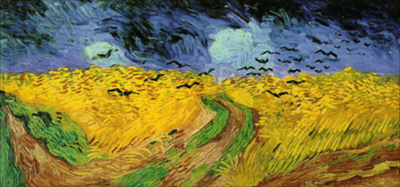

# STAT 305 Homework 3

Name: Jiapeng Wang

Email: jwang2928@wisc.edu

```{r setup, include=FALSE}
knitr::opts_chunk$set(echo = TRUE)
if (!require("png")) {
  install.packages("png")
  stopifnot(require("png"))
}
setwd('E:/stat-visp/R305')#seting work dictionary
```

# Part 1 :Implement a parallel mean lter for image smoothing

Read the image into R
```{r}
vg <- readPNG("Van_Gogh.png")

red.vg <- vg[,,1]
green.vg <- vg[,,2]
blue.vg <- vg[,,3]

n <- dim(vg)[1]
m <- dim(vg)[2]
```

Create function to filter matrix
```{r}
filter_matrix <- function(matrix, k) {

  dims <- dim(matrix)
  n <- dims[1]
  m <- dims[2]
  
  pad_matrix <- matrix(0, n + 2 * k, m + 2 * k)
  pad_matrix[(k + 1):(n + k), (k + 1):(m + k)] <- matrix
  
  filtered_matrix <- matrix(0, n, m)
  
  for (i in (k + 1):(n + k)) {
    for (j in (k + 1):(m + k)) {
      window <- pad_matrix[(i - k):(i + k), (j - k):(j + k)]
      filtered_matrix[i - k, j - k] <- mean(window)
    }
  }
  
  return(filtered_matrix)
}

```

Create filtered image
```{r}
for (k in c(1, 3, 5)) {
  
  filtered_red.vg <- filter_matrix(red.vg, k)
  filtered_green.vg <- filter_matrix(green.vg, k)
  filtered_blue.vg <- filter_matrix(blue.vg, k)
  
  image <- array(1:m*n*3, dim = c(n, m, 3)) 
  image[,,1] <- filtered_red.vg
  image[,,2] <- filtered_green.vg
  image[,,3] <- filtered_blue.vg
  
  output_file <- paste0("USERNAME_", k, ".png")
  writePNG(image, output_file)
}
```



# Part 2 :Detect edges

Create edge detection function
```{r}
filter_edge <- function(matrix, k, threshold_percent) {
  dims <- dim(matrix)
  n <- dims[1]
  m <- dims[2]   
  
  pad_matrix <- matrix(0, n + 2 * k, m + 2 * k)
  pad_matrix[(k + 1):(n + k), (k + 1):(m + k)] <- matrix
  sd_filtered_matrix <- matrix(0, n, m)
  
  window_indices <- lapply(1:(n * m), function(idx) {
    i <- ((idx - 1) %/% m) + 1
    j <- idx %% m
    if (j == 0) j <- m
    list(i = i, j = j, rows = (i - k):(i + k), cols = (j - k):(j + k))
  })
  
  for (idx in 1:(n * m)) {
    i <- window_indices[[idx]]$i
    j <- window_indices[[idx]]$j
    rows <- window_indices[[idx]]$rows
    cols <- window_indices[[idx]]$cols
    
    sd_filtered_matrix[i, j] <- sd(pad_matrix[rows, cols])
  }
  
  global_threshold <- quantile(sd_filtered_matrix, threshold_percent)
  
  edge_pixels <- sd_filtered_matrix > global_threshold
  matrix[edge_pixels] <- 1
  
  return(matrix)
}
```

find edges in the Van Gogh painting
```{r}
k <- 1
threshold <- 1 - 0.1

filtered_edge_red.vg <- filter_edge(red.vg, k, threshold)
filtered_edge_green.vg <- filter_edge(green.vg, k, threshold)
filtered_edge_blue.vg <- filter_edge(blue.vg, k, threshold)

edge_image <- array(1:m*n*3, dim = c(n, m, 3)) 

edge_image[,,1] <- filtered_edge_red.vg
edge_image[,,2] <- filtered_edge_green.vg
edge_image[,,3] <- filtered_edge_blue.vg

writePNG(edge_image, target = "VG_edge.png")
```

the feature of the painting emphasized by edges from the red channel
```{r}

image(t(filtered_edge_red.vg[nrow(filtered_edge_red.vg):1,]), main = "Edge detection of red channel")

```

# Answer:

We can see that a lot of the black and green parts have been changed to white in this image, indicating that these parts are emphasized by edges from the red channel.


find edges in the Madison photo
```{r}
madison <- readPNG("Madison.png")

n <- dim(madison)[1]
m <- dim(madison)[2]

red.madison <- madison[,,1]
green.madison <- madison[,,2]
blue.madison <- madison[,,3]

filtered_edge_red.madison <- filter_edge(red.madison, k, threshold)
filtered_edge_green.madison <- filter_edge(green.madison, k, threshold)
filtered_edge_blue.madison <- filter_edge(blue.madison, k, threshold)

edge_image <- array(1:m*n*3, dim = c(n, m, 3)) 

edge_image[,,1] <- filtered_edge_red.madison
edge_image[,,2] <- filtered_edge_green.madison
edge_image[,,3] <- filtered_edge_blue.madison

writePNG(edge_image, target = "Madison_edge.png")
```
   

# Answer:

This picture shows the outline of Madison's roads and blocks.
